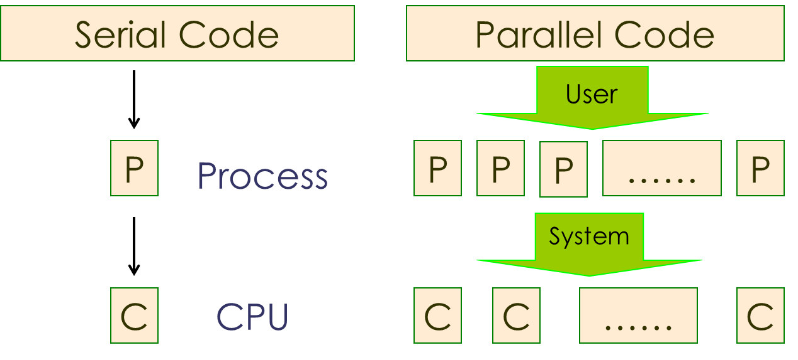
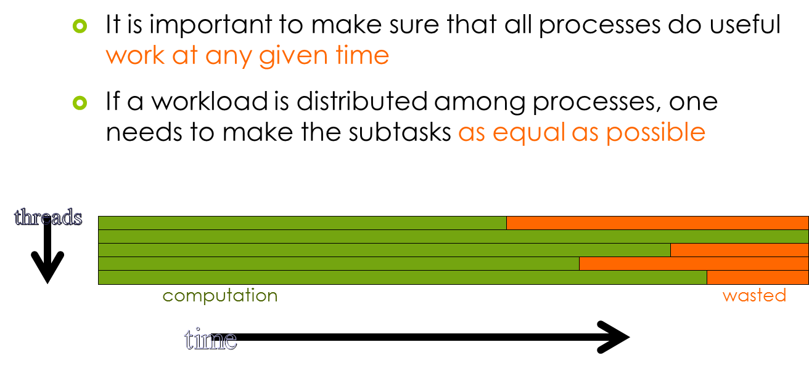
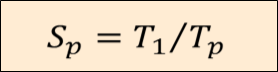
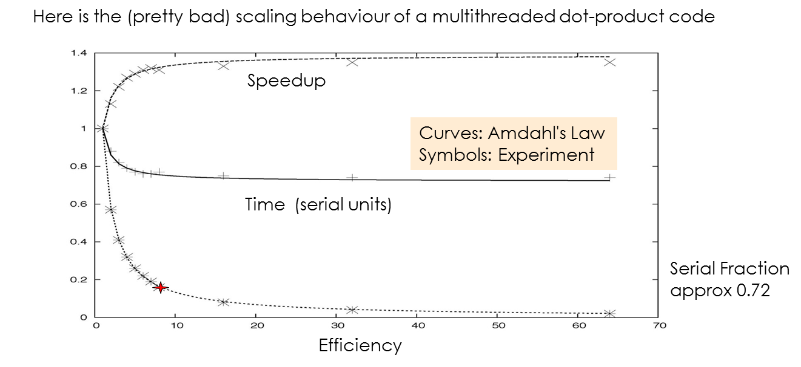

---
layout: page
title: Parallel Computing
subtitle: Why Parallel ?
minutes: 20
---
> ## Learning Objectives {.objectives}
>
> *   Explain why we need parallel computing.
> *   Lear what parallel computing is.
> *   Run a simple parallel (multithreaded) program.
> *   Do some external timing to see scaling.

## Moore's Law

Sometimes computational task are very demanding. A lot of memory my be required to keep large amounts of data around for easy access. Arithmetic operations may be complex and there may be billions of them. A routine may have to be executed a very large number of times to arrive at a result. An increase in computational workload calls for an increase in computational resources. In the past that usually meant that one needed a better, i.e. a faster computer. Luckily, computers had a way to satisfy these increasing demands by doubling their capacity every couple of years. In fact, one could count on it, and this observation was given a name: <a href="https://en.wikipedia.org/wiki/Moore%27s_law">Moore's Law</a>. Here's a picture of it (thanks, reddit):

The capacity of a computer's processing unit is roughly proportional to the number of transistors you can cram on it. Note that the y-axis of this graph is logarithmic. We can see that the number of transistors increases by an order of magnitude every 6 or 7 years. In recent times though, the "chips"" we are looking at are of the "multicore" variety, i.e. they have more than one processing unit on it. This is generally the case: In the last two decades improvement of computers has been largely due to "more" rather than "faster". Computing has turned parallel. What exactly does that mean?

## Parallelism

As usual, Wikipedia has the answer:

~~~ {.python}
Parallel computing is a type of computation in which many calculations are carried out simultaneously, operating on the principle that large problems can often be divided into smaller ones, which are then solved at the same time.
~~~

The key point is of course the division of larger problems into smaller ones. Each of the smaller problems can be tasked to a separate computing units, i.e . A core, a CPU, a chip, a machine etc. For this to work though, there is one more crucial condition:

~~~ {.output}
The sub-tasks in a parallel computation must be independent from each other.
~~~

If one task is independent from the other we can do them all simultaneously on different components. If one depends on an other, i.e. I can only work on one after I have completed another, I end up having to do them in order, and I gain nothing. So the first step in "parallelizing" a program is to identify how to split the workload into preferably equal sub-tasks that have little or nothing to do with each other. The next step is to send these to different processors. There is many ways to do this, and we will learn about some of them.

So the point is to have multiple processes going on simultaneously, each acting independently, but overall working on the same overall project. They can be sent to the different hardware components we have available, for instance the cores in a multicor machine or the nodes in a cluster. Usually it is the user who determines how many of these workers they want to be there. The system has a limited number of processors, of course, and quite often it is left to the machine to figure out on which part of these the job is actually running. Note that the number of processes we start is not necessarily the same a the number of cores/chips/nodes etc we have available. You can run 100 processes on a handful or processors, but that may not be a good idea. 

## Load Balancing

One really important thing is to make sure that all the processes do approximately the same amount of work. If we don't make sure of that, we end up some of them sitting around doing nothing most of the time.

This is not as easy as it may seem. Sometimes all that is required to distribute a workload is to let one process do some of the iterations in a loop, and another does the others. If we give each the same number of iterations to do, and most of the work's done in that loop, we're good. That is the case in our example below, but sometimes it may not. If each of the iterations takes a wildly differing time to do, we may inadvertedly incur load imbalances. There's things we can do about that, but that's a bit outside of the scope here. 

## Sum of Square Roots

For now let's look at how a parallel program runs. In the directory ~/sqroots you find a program "sqroots" which computes the sum of the square roots of consecutive integers from 0 to a maximum one N. If N is chosen large enough (of the order of billions) it is worth while to do this in parallel. Most of the computational work is in the computation of the square roots, while the sum is almost negligible. We can therefore compute the sum of a subset of the roots on one processor and others on another. At the end we sum all the partial sums into a total sum. That should reduce the runtime because the partial sums stand to take proportionally less time than the total.

The program "sqroots" was written in Fortran, but that shouldn’t bother us. It uses a parallel system called "OpenMP" that is used for multicore "shared memory" machines, but that shouldn’t bother us either. To tell the system how many processors we want to use, we need to set a so-called environment variable called OMP_NUM_THREADS, which we can do by preceding the program call with the setting:

~~~ {.python}
OMP_NUM_THREADS=2 ./sqroots.exe
1234567
~~~
~~~ {.output}
  Result =   914494295.63120651
~~~

Here we are running with two processors. Since we have chosen the maximum number N a bit small, it was over too quickly for us to tell the difference between different processor numbers. Also it may turn out to be a bit tedious to re-type the number all the time. So we can write the number first into a file, then re-use the file. Finally it would be best to measure the runtime automatically. The easiest way to do this using the "time" Unix function.

~~~ {.python}
$ echo 1234567890 > sqroots.in
$ OMP_NUM_THREADS=1 time -p ./rootsum.exe <rootsum.in
~~~
~~~ {.output}
  Result =   28918862541603.5
real 6.03
user 6.02
sys 0.00
~~~
~~~ {.python}
$ OMP_NUM_THREADS=2 time -p ./rootsum.exe <rootsum.in
~~~
~~~ {.output}
  Result =   28918862541602.9
real 3.60
user 6.62
sys 0.00
~~~
~~~ {.python}
$ OMP_NUM_THREADS=4 time -p ./rootsum.exe <rootsum.in
~~~
~~~ {.output}
  Result =   28918862541602.8
real 2.00
user 7.98
sys 0.00
~~~
~~~ {.python}
$ OMP_NUM_THREADS=8 time -p ./rootsum.exe <rootsum.in
~~~
~~~ {.output}
  Result =   28918862541603.0
real 0.80
user 6.07
sys 0.00
~~~

## Scaling and Amdahl's Law

Looks like the time is substantially reduced in each step. Ideally, we would like the time to be reduced by half whenever we double the number of processes. To be sure that's not quite the case here. This may have various reasons, such as other people using resources on the system, or parts of the program not running properly in parallel. The ratio between the serial and the parallel runtime is called "speedup":

We'd like that number to be equal to the number of processors, i.e. if we are using 8 processors then the serial runtime should be 8 times as large as the parallel one. This is called "ideal" or "linear" scaling. It can be achieved for smaller numbers of processors, but as the number increases it gets harder and harder to do it. One limitation may be that not everything in your program runs actually in parallel. If that's the problem, "Amdahl's Law" kicks in. It gives you a rule of thumb what kind of speedup you can expect if you are using a number of processors but a part of your code runs in serial:

Fs is the fraction of the code that's serial, and p is the number of processes you're using. Smax is the best speedup you can expect under those circumstances. For instance if you got 2 processes running in a half-serial program you end up with a speedup of 4/3 although you'd like to have 2. You can also see that no matter how many processes you run you can never do better than 1/2 because the other half is still running in serial. Here is a picture of a pretty brutal case of Amdahl's Law:

Three quarters of what this program does happens in serial mode, and we can see how quickly the speedup "bends away" from linear. By the way, this gives you a good rule of thumb: "Don't use more processors for your program than the inverse of its serial portion". So if you got about 1% of your code still running in serial, don't use more than 100 processors.
 
