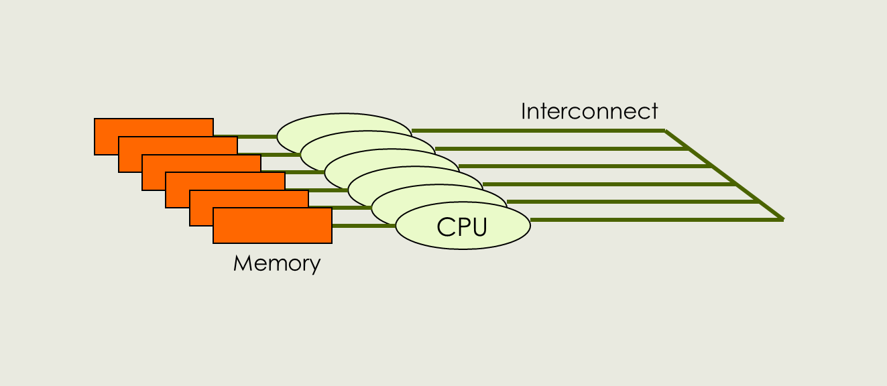

> ## Learning Objectives {.objectives}
>
> *   Learn the difference between shared and distribruted memory.
> *   Understand the advantages and disadvantages of each architecture.

There are many kinds of parallel computers, but most of them are combinations of two different basic base types: shared-memory machines and distributed-memory clusters. 

## Shared Memory

Shared memory machines are the easier ones to use and were the ones introduced first. They can loosely be described as "multiple processors in a box". In such a machines, multiple processing units (CPUs or cores) are all connected to a common memory, and all processors can access all of the memory. If they all do so in the same way, i.e. they have no preference what part of the memory they can reach easier, such machines are called "SMP" (Symmetric Multi Processor). If there is substantial differences because some memory is more closely associated with one processor, and other parts with others, then the machine is called "NUMA" (Non-uniform Memory Access). Still, all of these are considered "shared memory" because all processors can see all the memory:

<figure><figcaption>Shared Memory Computer</figcaption></figure>

That's admitedly a bit schematic. Here's a picture of an actual machine of that type, one of the "big irons" at HPCVL. It is a Fujitsu/Sun build "Enterprise M9000 Server":

These machines are relatively easy to program for, because all processors see the same "memory space". It is like multiple workers participating in the same project, all in the same room. One still has to be careful to make sure the processors don't get into each others way, but it is comparably easy to turn a serial (one-processor) program into a shared-memory parallel program. We're going to return to this kind of parallel computer a little more in the next lesson.

## Distributed Memory (Clusters)

Another type of parallel computer is called "Distributed-Memory" computer, also know as "cluster". This architecture is more akin to "a room full of computers" all connected among each other with a lot of cables. Each of the units has their own memory, and none of them sees the memory of the others. If one of the units holds some information that the other one needs, they have to "talk" with each other, i.e. send the information through the "interconnect", the cables mentioned earlier.

<figure><figcaption>Distributed Memory Cluster</figcaption></figure>

Here's a picture of some of the nodes form our Linux cluster. They are all in a rack, but you can see the separate nodes as segments. On the back there's a lot of cables for communication.

This type of parallel computer is more demanding to program for. Required information has to be passed around and that has to be programmed explicitly. In addition the communication introduces a major bottle neck, as communicating through even fast cable is usually slower than doing a lot of computation. It's like multiple workers collaborating remotely, using a phone. You may have to deal with delays, busy signals, and "call waiting". However, once you have programmed something that runs on a cluster, it will run anywhere. This is a great advantage. We will revisit Distributed-Memory programming later and apply a few basic routines to our Mandelbrot program in Python.

## Pros and Cons

So which of these two architectures is better. Here's a table with advantages and disadvantages:

<figure><figcaption>Pros and Cons of SM and DM</figcaption></figure>

From this it is pretty clear that shared memory is the better choice:  It can run any type of program, including the ones written for clusters. We will see about this later, since we're running cluster-enabled MPI programs on a shared-memory machine. They are easier to program for and require less configuration and tuning. They don't have the communication bottleneck because they need little communication. Alas, they cost an arm and a leg. And they can't be scaled up to really, really big with thousands of processors. Because of this, most people who need to do some serious parallel computing use clusters to do it.

