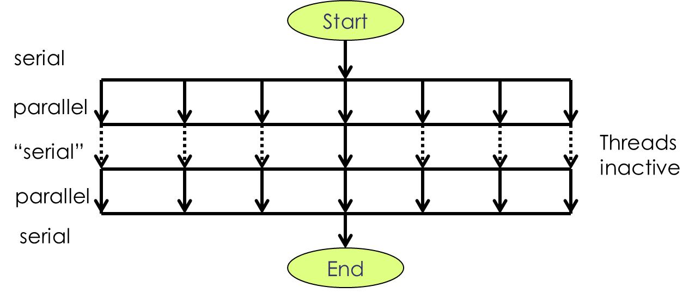

---
layout: page
title: Parallel Computing
subtitle: Multicore Machines and Multithreading
minutes: 20
---
> ## Learning Objectives {.objectives}
>
> * Learn about shared memory machines in more detail.
> * Learn about ways to program multiple threads.
> * Learn about pitfalls in multithreaded programs.
> * Start a multithreaded program and monitor it while running. 

## Threads ("Lightweight Processes")

If you are working on a multicore laptop, you have  shared-memory machine right in front of you. We are doing our exercises on single-node servers that are small shared-memory machines of the "almost SMP" type. There are several ways of programming for these machines, but the most efficient and easiest way is "multi-threading". 

Multithreading involves the dynamic creation of extra "light-weight processes" ; these are processes that have just enough stuff attached to them to do an independent job, but still share resources with other processes (such as cache and memory). The program is started like any other serial program, but during execution creates new processes that help with a workload when possible:

<figure><figcaption>Multithreading on a Shared-Memory Machine</figcaption></figure>

One process (the main or master process) is always there. Typically it is the only one at the beginning and the end of the program. In between, additional ones are created and destroyed, as needed.

## Multithreading

Multi-threading can be done in three different ways:

* Automatically: Some compilers have the capability of finding regions in standard serial programs and "parallelizing" them, i.e. produce parallel code at compilation without additional work from the programmer. This usually is restricted to very simple loops, and works only if each of the loop iterations involves a workload that is independent of the workload from other loop iterations. This is called "Loop Parallelism".

* Explicitly using a thread library: This is the hard way. It is very flexible but everything has to be programmed explicitly through function calls. A very widely use thread library is the Posix Thread (pthread) library which uses C interfaces. Don't worry we won't subject you to this.

* Using Compiler Directives: This is  very popular alternative. The one most commonly used is called "OpenMP" and we have already encountered a program that was written using it. Compiler directives are like "local compiler flags", i.e. instructions to the compiler such as "parallelize this region of code" to help it turning serial source code into parallel executables. This is a lot easier than thread libraries, and much more applicable than automatic parallelization. A golden middle, so to speak.

Multithreading is reasonably straightforward to do, but there are pitfalls. One always has to be careful to make sure that multiple threads do not get into each other's way. Here's a few situations that often occur that need to be worked around:

* Dependencies among sub-tasks: Quite often one does multi-threading in loops. Each process or thread handles a sub-set of the loop iterations. This can often be achieved by inserting a single compiler directive into serial code. But careful: if any of the loop iterations depends on any of the others (for instance it needs results from that other iteration), this does not work. If one does it anyway, the code breaks and the results are wrong. This can be a problem that prevents parallelization altogether.

* Memory Conflicts, for instance race-conditions: This happens if multiple threads are using the same memory location, namely writing into it. If they are trying to do so almost at the same time, the potential for wrong results is great. Imagine two processes trying to update the value of the same variable at the same time. One process may undo or otherwise "mess up" the others actions. This can usually be fixed by using locks which are functions that get called by one process and prevent others from interfering with the data it handles. Sounds complicated but isn't really. But it has a potential of slowing things down by creating waiting periods for threads.

* False Sharing: This has to do with cache handling. It doesn't break the code, but it creates a situation where one process forces the others to use cache very inefficiently. In extreme cases, one process does something useful, while all others are constantly re-loading cache from main memory and throwing it out again, slowing everything to a crawl.

## How it looks on the machine

Let's have another look at the program that we were running earlier (that would be "rootsum.exe" whcih computes the sum of square roots in poarallel).
With a reasonable large input number (of the order of billions) we can keep the program running for long enough to do a bit of monitoring with the "top" program:

~~~ {.bash}
$ cat rootsum.in
~~~
~~~ {.output}
1234567890
~~~
~~~ {.bash}
$ OMP_NUM_THREADS=2 time -p ./rootsum.exe <rootsum.in &
$ top
~~~
~~~ {.output}
top - 15:12:44 up 5 days,  4:55,  1 user,  load average: 0.15, 0.08, 0.03
Tasks: 237 total,   2 running, 235 sleeping,   0 stopped,   0 zombie
Cpu(s):  0.0%us,  0.0%sy,  0.0%ni,100.0%id,  0.0%wa,  0.0%hi,  0.0%si,  0.0%st
Mem:  16331352k total,  1498124k used, 14833228k free,   235172k buffers
Swap: 94334972k total,        0k used, 94334972k free,   885940k cached

  PID USER      PR  NI  VIRT  RES  SHR S %CPU %MEM    TIME+  COMMAND
25791 user00    20   0 37128 1636 1328 R 196.2  0.0   0:04.44 rootsum.exe
25793 user00    20   0 27612 1296  888 R  1.9  0.0   0:00.02 top
    1 root      20   0 25596 1588 1256 S  0.0  0.0   0:01.08 init
    2 root      20   0     0    0    0 S  0.0  0.0   0:00.02 kthreadd
    3 root      RT   0     0    0    0 S  0.0  0.0   0:00.00 migration/0
    4 root      20   0     0    0    0 S  0.0  0.0   0:00.00 ksoftirqd/0
~~~

Hopefully you can catch the %CPU in the first process "rootsum.exe". It says here 196.2 which means it's keeping two CPU's almost busy. Note that this is only one main process so you get only one line in the top command.

But let's move on the distribute-memory programs and MPI.
