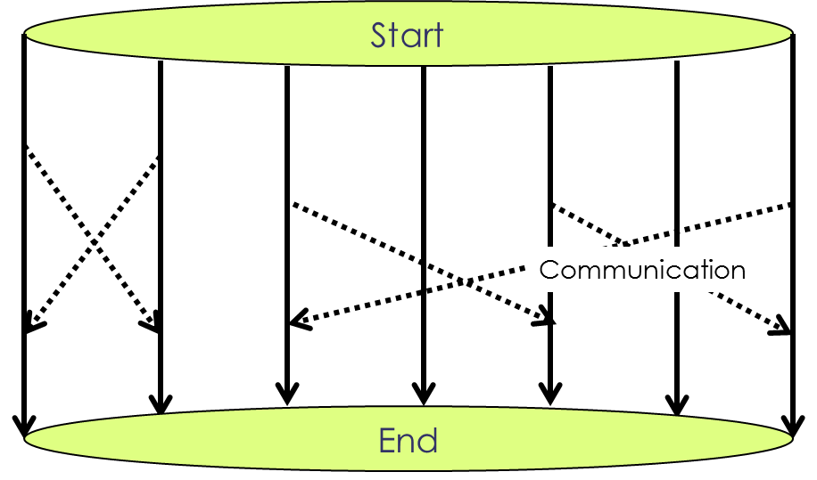

---
layout: page
title: Parallel Computing
subtitle: Clusters and Message Passing
minutes: 20
---
> ## Learning Objectives {.objectives}
>
> *   Use a library function to get a list of filenames that match a simple wildcard pattern.
> *   Use a for loop to process multiple files.

## Heavyweight Processes

If a computational problem is very large, the limitations of shared-memory machines (not to mention the price tag on the big ones) become an issue. The largest shared memory machines have less than 1000 cores or CPUs, and if that's not enough, we have to use a cluster. Since clusters are essentially many individual machines connected via a communication system, the communication is a crucial part of the code. This has to be done explicitly, because it is too complicated for automatic compilation or even compiler directives.

The structure of a program that is designed for a cluster resembles the simultaneous independent run of the same code on multiple computers with an added communication between these processes ("Message Passing"):

<figure><figcaption>Message Passing on a Distributed Memory Cluster</figcaption></figure>

## MPI and Runtime Environment (mpirun)

The standard API that is used to establish communication is called MPI (Message Passing Interface). It's a set of about 200 routines that are used to make processes that run on different CPU's "talk with each other". There are interfaces for Fortran, C, and C++, and some kind soul has provided some of the interfaces (you guessed it) for Python. But well get back to that later.

Unlike shared-memory programs, MPI programs have to be started "from the outside". Since each of the multiple processes are full-fledged standalone program runs, we can't just type the program name as we did in the case of a multithreaded application. Instead we are using a "runtime environment" that starts the individual processes on the proper hardware and establishes the communication paths. Most of the time the command that starts this runtime environment is called mpirun.

There are many implementations of MPI, and there are many moving parts involved in it. Usually it is installed in a specific part of the system and you can look at it and familiarize yourself with it. The implementation we are using is called OpenMPI (version 1.8), as we can determine by the "which" command:

~~~ {.bash}
$ which mpirun
~~~
~~~ {.output}
/opt/openmpi-1.8/bin/mpirun
~~~
~~~ {.bash}
$ mpirun -V
~~~
~~~ {.output}
mpirun (Open MPI) 1.8.2

Report bugs to http://www.open-mpi.org/community/help/
~~~

We get an idea about what's there by listing the /opt/openmpi-1.8 directory:

~~~ {.bash}
$ ls /opt/openmpi-1.8/*
~~~
~~~ {.output}
/opt/openmpi-1.8/bin:
mpic++     mpif90        opari        oshmem_info    otfprofile-mpi  vtfilter
mpicc      mpif90-vt     ortecc       oshrun         otfshrink       vtfiltergen
mpiCC      mpifort       orte-clean   otfaux         shmemcc         vtfiltergen-mpi
mpicc-vt   mpifort-vt    orted        otfcompress    shmemfort       vtfilter-mpi
mpiCC-vt   mpirun        orte-info    otfconfig      shmemrun        vtfort
mpic++-vt  ompi-clean    orte-ps      otfdecompress  vtc++           vtrun
mpicxx     ompi_info     orterun      otfinfo        vtcc            vtsetup
mpicxx-vt  ompi-ps       orte-server  otfmerge       vtCC            vtsetup.jar
mpiexec    ompi-server   orte-top     otfmerge-mpi   vtcxx           vtunify
mpif77     ompi-top      oshcc        otfprint       vtf77           vtunify-mpi
mpif77-vt  opal_wrapper  oshfort      otfprofile     vtf90           vtwrapper

/opt/openmpi-1.8/etc:
openmpi-default-hostfile  openmpi-totalview.tcl  vtsetup-config.xml
openmpi-mca-params.conf   vtsetup-config.dtd

/opt/openmpi-1.8/include:
mpi-ext.h         mpif-handles.h           mpp             shmem.h
mpif-config.h     mpif-io-constants.h      openmpi         shmemx.h
mpif-constants.h  mpif-io-handles.h        pshmem.h        vampirtrace
mpif-externals.h  mpif-sentinels.h         pshmemx.h
mpif-ext.h        mpi.h                    shmem-compat.h
mpif.h            mpi_portable_platform.h  shmem.fh

/opt/openmpi-1.8/lib:
libmca_common_sm.la        libopen-pal.so.6               libvt.la
libmca_common_sm.so        libopen-pal.so.6.2.0           libvt-mpi.a
libmca_common_sm.so.4      libopen-rte.la                 libvt-mpi.la
libmca_common_sm.so.4.0.4  libopen-rte.so                 libvt-mpi.so
libmpi_cxx.la              libopen-rte.so.7               libvt-mpi.so.0
libmpi_cxx.so              libopen-rte.so.7.0.4           libvt-mpi.so.0.0.0
libmpi_cxx.so.1            libopen-trace-format.a         libvt-mpi-unify.a
libmpi_cxx.so.1.1.3        libopen-trace-format.la        libvt-mpi-unify.la
libmpi.la                  libopen-trace-format.so        libvt-mpi-unify.so
libmpi_mpifh.la            libopen-trace-format.so.1      libvt-mpi-unify.so.0
libmpi_mpifh.so            libopen-trace-format.so.1.0.0  libvt-mpi-unify.so.0.0.0
libmpi_mpifh.so.2          liboshmem.la                   libvt-mt.a
libmpi_mpifh.so.2.4.0      liboshmem.so                   libvt-mt.la
libmpi.so                  liboshmem.so.3                 libvt-mt.so
libmpi.so.1                liboshmem.so.3.0.0             libvt-mt.so.0
libmpi.so.1.5.2            libotfaux.a                    libvt-mt.so.0.0.0
libmpi_usempi.la           libotfaux.la                   libvt-pomp.a
libmpi_usempi.so           libotfaux.so                   libvt-pomp.la
libmpi_usempi.so.1         libotfaux.so.0                 libvt.so
libmpi_usempi.so.1.3.2     libotfaux.so.0.0.0             libvt.so.0
libompitrace.la            libvt.a                        libvt.so.0.0.0
libompitrace.so            libvt-hyb.a                    mpi.mod
libompitrace.so.0          libvt-hyb.la                   openmpi
libompitrace.so.0.0.0      libvt-hyb.so                   pkgconfig
libopen-pal.la             libvt-hyb.so.0
libopen-pal.so             libvt-hyb.so.0.0.0

/opt/openmpi-1.8/share:
man  openmpi  vampirtrace
~~~

Luckily we don't have to worry about most of this until we're getting really serious with MPI programming. But it does not hurt to get an idea. The stuff in the "lib" directory are tools that we may need to run MPI programs, compile code with MPI, and configure machines to run with it. The only one we're going to use is "mpirun".

In the "lib" directory, there's a lot of ".so" files. These are libraries that contain all the routines that MPI consists of. The Python version of MPI is clever enough to pick the right ones there, so we don't worry about that either.

In the "include" directory, we have header (.h) files. These declare for programming languages like Fortran or C all the variables and constants etc that we need to build an MPI program. Again, the Python version hides most of this.

## How it looks on the machine

Let's try this out. In the same directory that we used in the last segment, there is another program called MPIrootsum.exe. This thing does the same "sum of square roots" computation as the OMProotsum.exe we used before. Got into the directory and start it as follows:

~~~ {.bash}
$ mpirun -np 2 ./MPIrootsum.x 
~~~
~~~ {.output}
How many terms?
~~~
~~~ {.bash}
1234567890
~~~
~~~ {.output}
 RANK:           0 MYS=   14459431279586.3       M:  1234567890
 RANK:           1 MYS=   14459431262016.8       M:  1234567890
 Total sum:     28918862541603.1
 Total time on rank 0:     2.98754600000000
~~~

The -np 2 option to the mpirun command tells the system to start 2 processes, in other words, run the program twice. In our case we don't really have a cluster that we run this on. Instead we are running it on the same hardware we ran the shred-memory program on before. But that's OK, because you can run MPI programs on almost anything. As long as teach of the program runs can go to different CPUs (i.e. as long as you're using a parallel computer of some type), it will benefit from the hardware. In this particular case, we have each of the program runs compute only the sum of half of the square roots, and then one process communicates its result to the other and the other ("rank 0") sums up the two partial sums. Each prints out their intermediate result and one of them shows the total. Also printed out is the time requirements of one of them - we're assuming the other is not far behind. Let's see how long it takes to do it with only one:

~~~ {.bash}
$ mpirun -np 1 ./MPIrootsum.x < rootsum.in
 How many terms?
 RANK:           0 MYS=   28918862541603.5       M:  1234567890
 Total sum:     28918862541603.5
 Total time on rank 0:     5.85311000000000
~~~
Sure enough, almost twice as long. There are of course some losses. In practice, most of the issues one encounters with MPI programs and lack of scaling are due to communication. As mentioned before that is the bottle neck.

One more time, this time with monitoring through "top". Notice how we're adding the "&" to submit the actual run to the background so we have a free terminal and can use "top" to look at the stuff that's running.

~~~ {.bash}
$ mpirun -np 2 ./MPIrootsum.x < rootsum.in
$ top
~~~
~~~ {.output}
top - 15:37:38 up 5 days,  5:20,  1 user,  load average: 0.01, 0.06, 0.02
Tasks: 238 total,   3 running, 235 sleeping,   0 stopped,   0 zombie
Cpu(s):  0.0%us,  0.0%sy,  0.0%ni,100.0%id,  0.0%wa,  0.0%hi,  0.0%si,  0.0%st
Mem:  16331352k total,  1510564k used, 14820788k free,   235676k buffers
Swap: 94334972k total,        0k used, 94334972k free,   890624k cached

  PID USER      PR  NI  VIRT  RES  SHR S %CPU %MEM    TIME+  COMMAND
26049 user00    20   0  252m 5616 3276 R 98.2  0.0   0:01.96 MPIrootsum.exe
26050 user00    20   0  252m 5548 3208 R 98.2  0.0   0:01.95 MPIrootsum.exe
    1 root      20   0 25596 1588 1256 S  0.0  0.0   0:01.08 init
    2 root      20   0     0    0    0 S  0.0  0.0   0:00.02 kthreadd
~~~

Unlike with the shared-memory program OMProotsum that we ran in the last lesson, we're seeing here two lines in the top command. Each is a full run of MPIrootsum.exe, and each use close to 100% of a CPU. This fits together with what we have learned about MPI programs. The only reason we are seing the two processes in top like this is that they are both running on the same node. They could be spread out across a cluster.

