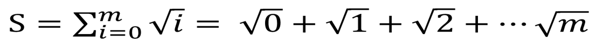

> ## Learning Objectives {.objectives}
>
> * Use collective communication in MPI.
> * Learn how to use Bcast() to distribute information
> * Learn how to use Reduce() to collect results.
> * Timing a parallel program to check scaling

Our next step is to replace the point-to-point approach for communication by collective operations. There is often a great advantage to doing this. P2P usually requires loops over multiple processes, and careful consideration who sends what to whom. These multiple operations may be replaced by a single function call when collective operations are used instead. Collective communication also is often more efficient, because the communication pattern has been pre-programmed by professionals and happens "under the hood".

## The sum of square roots, again

Let's return to an example we have already encountered. The sum of square roots of integers, ranging from 0 to a maximum number m. Earlier we looked at OpenMP (multithreaded) and MPI versions of that program. These were programmed in Fortran, which is a rather low-level programming language that is nowhere as sophisticated as Python. (However, compared with Python, it's blazingly fast!)

The way we want to go about it is like this:
* First we determine which of the square roots are computed by which process. A reasonable choice is to go about it round-robin: if we have 4 processes, number 0 does 0, 4, 8, 12 ...; number 1 does 1, 5, 9, 13 ...; etc.
* We have each of the process compute a partial sum that includes all the square roots it evaluated.
* Finally, we sum up all the partial sums into a total sum and have that printed out by one of the processes (as usual that would be the one with rank 0)

For starteres, let's copy out hello world example again so we don't type ouselves to death:

cp ./MPIhello.py ./MPIrootsum.py

Then we edit the new MPIrootsum.py. Let's delete "Hello World" line:

~~~ {.python}
#!/usr/bin/env python3

from mpi4py import MPI

comm = MPI.COMM_WORLD
rank = comm.Get_rank()
size = comm.Get_size()
~~~

We need a few extra packages: 
* numpy because numpy arrays work best with MPI4py, particularly if we don't want to explicitely type our data.
* math because we need a square root
* time because we want to insert some timing routines to check if our program scales nicely.

Let's add the corresponding lines below the one that imports MPI:

~~~ {.python}
import math
import numpy as np
import time as tm
~~~

Next thing to do is make three variables we will need for the computation: The maximum number m, the partial sum "partial", and the result "total". We make them all into "numpy arrays" of only one element, so our life is easier with the MPI function calls.

~~~ {.python}
m=np.zeros(1)
total=np.zeros(1)
partial=np.zeros(1)
~~~

Now we have one of the processes (rank 0) read in the maximum number m from the console. Also, at this point we want to "start to clock" for our timing. We do that after reading in m, because we don't want to measure how long it takes us to hammer in a number.

~~~ {.python}
if rank == 0:
    m[0]=input("Please give the maximum integer m:")
    start=tm.time()

~~~

Don't forget the blank line at the end.

At this point, only rank 0 knows m because only it has read it from the console. So now we need a "broadcast" so that all others get that information as well.

~~~ {.python}
comm.Bcast(m, root=0)
~~~

After that, we can use m in a loop over all integers that the corresponding process is responsible for. We atart with the rank, and always skip the number of processes, i.e. the size. Note that the upper limit of the loop looks a bit strange because we passed m as a numpy array and have to recast it. After wew've caculated the partial sum, we print it out.

~~~ {.python}
for index in range(rank, m[0].astype(int)+1, size):
    partial=partial+math.sqrt(index)

print("The partial sum of rank ", rank, "is", partial[0])
~~~

So now each process has a partial sum but no-one has the final result yet. So it's time for a Reduce() call, because that is what Reduce() does: reducing multiple partial to a final total. In our case through a summation:

~~~ {.python}
comm.Reduce(partial, total, op=MPI.SUM, root=0)
~~~

Almost done. All that remains to do is for the root process (rank 0) to print out the total, stop the clock and tell us how long the whole thing took:

~~~ {.python}
if rank == 0:
    print ("The total sum is", total[0])
    end=tm.time()
    print ("This took", end-start, "seconds.")

~~~

Let's try it out.

~~~ {.python}
$ mpirun -np 1 ./MPIrootsum.py
~~~
~~~ {.output}
Please give the maximum integer m:1234567
The partial sum of rank  0 is 914494295.631
The total sum is 914494295.631
This took 4.355911016464233 seconds.
~~~
~~~ {.python}
$ mpirun -np 2 ./MPIrootsum.py
~~~
~~~ {.output}
Please give the maximum integer m:1234567
The partial sum of rank  1 is 457247425.783
The partial sum of rank  0 is 457246869.848
The total sum is 914494295.631
This took 2.1954686641693115 seconds.
~~~
~~~ {.python}
$ mpirun -np 4 ./MPIrootsum.py
~~~
~~~ {.output}
Please give the maximum integer m:1234567
The partial sum of rank  2 is 228623712.97
The partial sum of rank  3 is 228623990.532
The partial sum of rank  0 is 228623156.877
The total sum is 914494295.631
This took 1.1212892532348633 seconds.
The partial sum of rank  1 is 228623435.251
~~~
~~~ {.python}
$ mpirun -np 8 ./MPIrootsum.py
~~~
~~~ {.output}
Please give the maximum integer m:1234567
The partial sum of rank  4 is 114311856.596
The partial sum of rank  7 is 114312272.746
The partial sum of rank  5 is 114311995.354
The partial sum of rank  6 is 114312134.068
The partial sum of rank  2 is 114311578.902
The partial sum of rank  1 is 114311439.898
The partial sum of rank  3 is 114311717.786
The partial sum of rank  0 is 114311300.281
The total sum is 914494295.631
This took 0.5708332061767578 seconds.
~~~
~~~ {.python}
$ mpirun -np 16 ./MPIrootsum.py
~~~
~~~ {.error}
--------------------------------------------------------------------------
A request was made to bind to that would result in binding more
processes than cpus on a resource:

   Bind to:     CORE
   Node:        hc10
   #processes:  2
   #cpus:       1

You can override this protection by adding the "overload-allowed"
option to your binding directive.
--------------------------------------------------------------------------
~~~
~~~ {.output}
Please give the maximum integer m:1234567
The partial sum of rank  2 is 57156067.2986
The partial sum of rank  6 is 57156345.2329
The partial sum of rank  4 is 57156206.3512
The partial sum of rank  5 is 57156275.8075
The partial sum of rank  0 is 57155927.3803
The partial sum of rank  1 is 57155997.6372
The partial sum of rank  9 is 57155442.2604
The partial sum of rank  11 is 57155580.9312
The partial sum of rank  10 is 57155511.6034
The partial sum of rank  8 is 57155372.9007
The partial sum of rank  3 is 57156136.8543
The partial sum of rank  13 is 57155719.5464
The partial sum of rank  14 is 57155788.8355
The partial sum of rank  12 is 57155650.2452
The partial sum of rank  7 is 57156414.6331
The partial sum of rank  15 is 57155858.1132
The total sum is 914494295.631
This took 0.8241209983825684 seconds.
~~~

The result's the same in all cases, and it scales pretty good up to 8 processes. If we're trying to double up to 16, then we get a warning from the system that we don't have that many cores, but it does it anyway. As you can see, the timing is worse than with 8 cores, so it definitely does not pay to overload the hardware and run more processes than you've got cores.

Note that while the python program here scales well enough, it is slower than a C or or FORTRAN version by a factor of several hundered.

