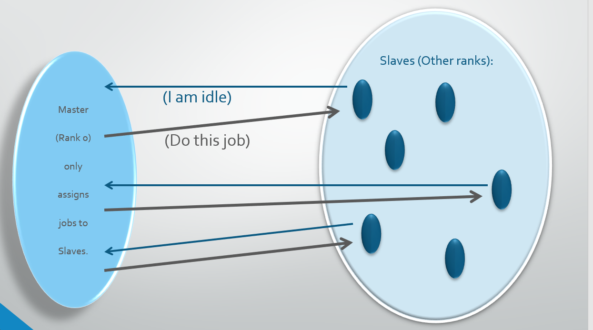

---
layout: page
title: Parallel Computing
subtitle: The Master Slave Model
minutes: 
---
> ## Learning Objectives {.objectives}
>
> * Understanding workload imbalances
> * Using point-to-point communication to distribute workload dynamically
> * Understanding the basic principle of the MSM model
> * Applying the MSM model to the Mandelbrot set

In this portion of the course we are addressing an issue that often causes problems when doing things in parallel: workload imbalances. For instance, let's say we are trying to optimize the confirmation of 10,000 small molecules that are candidates for a drug. We do this on a cluster with 100 cores, and use MPI to have each of the cores work on 100 of those molecules in sequence.

The problem is we don't know beforehand how long each of the optimizations will take, and so we may end up with the picture we saw earlier.

This problem can easily be resolved by dynamic scheduling. Instead of randomly assigning 100 molecules to each of the cores, let's give each only one molecule at a time. Once that molecule's "done", the process sends a signal asking for another one. This is called "dynamic scheduling" because which process gets which molecule is determined dynamically at runtime.

Typically, for an MPI program the task of assigning tasks is done by the root process, usually rank 0. The resulting schemed is called the Master-Slave model.

The Master process does not do any work other than assigning tasks. Since all the other processes are immediately given a new task when they are done with the previous one, they don't run out of things to do until the very end. So at the expense of a "wasted" process, we should have solved the load imbalance issue.

Here is the code for this in Python:
~~~ {.python}
#! /usr/bin/env python3

import cmath
import time as tm
import matplotlib.pyplot as plt
import numpy as np
import sys
from mpi4py import MPI

def InitialMPI() :
    global comm, MyID, TotalPS
    comm = MPI.COMM_WORLD
    MyID = comm.Get_rank()
    TotalPS = comm.Get_size()
    return

def MasterSlaveModelInitialize() :
    global Master, NumOfJobs
    Master = 0
    bcast = np.zeros(1)
    load()
    if ( MyID == Master ) :
        NumOfJobs = 20
        bcast[0] = NumOfJobs
        print( "Number of Jobs :", NumOfJobs )
        
    comm.Bcast( bcast, root=Master )
    NumOfJobs = bcast[0].astype(int)
    comm.Bcast( work, root=Master )
    print(work)
    
    return

def MasterSlaveModel() :

    mpitag = 1
    received = 0
    
    if ( MyID != Master ) :
        repeat = 1
        while ( repeat == 1 ) :
            
            comm.send( MyID, dest=Master, tag=mpitag+MyID )
            print( "Slave #", MyID, " reports to Master he's idle.", MyID )
            received = comm.recv( source=Master, tag=mpitag+MyID )

            if ( received <= NumOfJobs ) :
                DoOneJob( received, MyID )
                print( "Slave # ", MyID," received job # ", received, "." )
            else :
                print( "Slave # ", MyID, " received no more job instruction." )
                repeat=0
    else :

        for i in range( 1, NumOfJobs+TotalPS ) :
            received = comm.recv( source=MPI.ANY_SOURCE, tag=MPI.ANY_TAG )
            comm.send( i, dest=received, tag=mpitag+received )

            if( i <= NumOfJobs ) :
                print( "Master assigned job # ", i, " to slave # ", received, "." )
            else :
                print( "Master informed slave # ", received, " no more jobs." )

    return

def MasterSlaveModelFinalize() :
    return

def DoOneJob( jobnumber, myslavenumber ) :
    tm.sleep(work[jobnumber-1].astype(int))
    return

def load() :
    global work
    np.random.seed(123456)
    work = np.random.random(20)
    work = np.round(4*work+1)
    return

# Top of main routine

InitialMPI()
MasterSlaveModelInitialize()
MasterSlaveModel()
~~~

In this example, we are using some "fake workload". We generate a random sequence of 20 integers between 1 and 5 and have the processes wait for that many seconds. Boring, but ideal to test out the algorithm. We can check this on any computer, even a serial single-core machine. You don't need a powerful CPU to "sleep". We're using this approach to come up with a heterogeneous unpredictable workload. All that we need to do to turn this into a more exciting example, is replace the content of "DoOneJob" with the task we need performed.

Here are the basic features of the code:

* InitialMPI does the usual MPI setup: rank, size, etc
* MasterSlaveModelInitialize broadcasts the number of tasks and loads the random sequence of "seconds to sleep" via routine "load"
* MasterSlaveModel contains the main "action" of the model. Processes are reporting to the screen to tell you what they are presently doing.
* DoOneJob is the core of the work load. In this case "sleep a while".
* MasterSlaveModelFinalize can be used to "wrap things up" but in this example does nothing.

Note that the communication between the "master" and the "slaves" is done by pairs of send/receive. When the slavbe process is done, it send its rank to the master, and the master responds by sending the next "job number". In this case the job number is the element number in the "work" array that contains the number of seconds to sleep.

> ## Let's try this on Mandelbrot {.challenge}
>
> We may not have time for this, but here it is.
> You may have noticed that when we run the parallel version of the Mandelbrot program,
> the scaling's alright going from one to two processes, but from 2 to 4
> it's not so good. This is due to fact that the "black parts" of the set
> take longer to compute than the others. We could use the Master-Slave scheme
> to work around this problem.
> Use the "pixel-line" with fixed imaginary part as a job number.
> Note that you are working on an overall set, so there is the problem of how
> to get the results back to the master process. Use the Bcast()/Reduce()
> approach to do it.
> Hints: You won't need an "mrow" array that contains a specific pixel row.
> Instead you have a copy of "mandel" (i.e. all the pixels) on each process.
> First you fill it all with zeroes, then you compute only those rows in
> the total structure that the process was given as a task.
> At the end, you use Reduce() to send them to Rank 0.
> For each process there will be a lot of zeroes,
> but that won't matter because zeroes will not contribute to the MPI_SUM.
