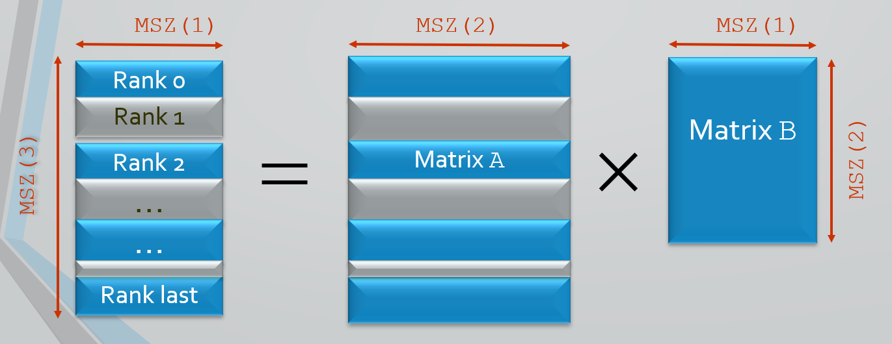
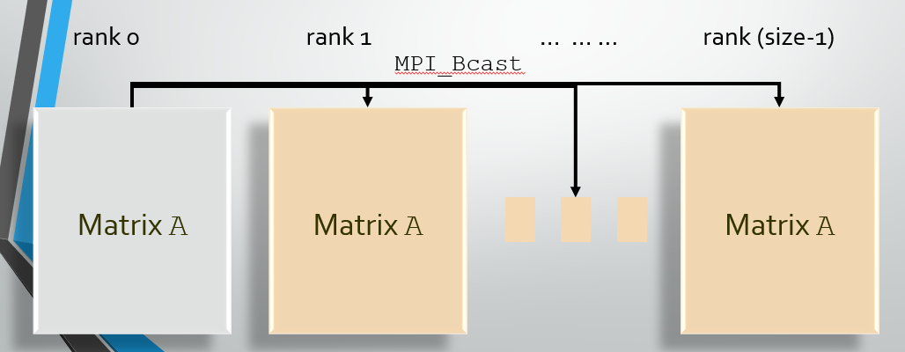
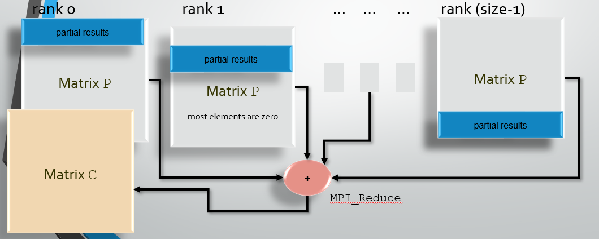
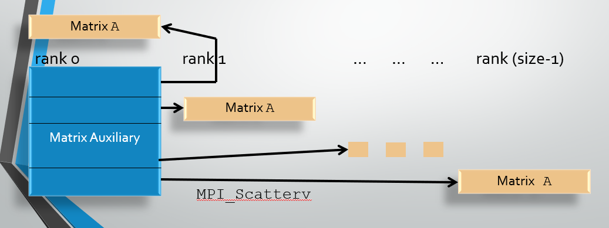
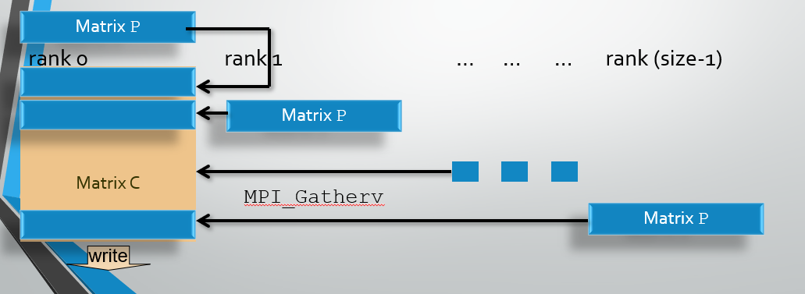

---
layout: page
title: Parallel Computing
subtitle: Memory Distribution: Matrix Multiplication
minutes: 
---
> ## Learning Objectives {.objectives}
>
> * Understanding the importance of memory distribution
> * Learning about different methods of distributing memory
> * Learning the application of Scatter/Gather for collective MD
> * Tracking timing and memory usage of programs

Early in this course we briefly mentioned the fact that by default, MPI replicates the full memory space of the program. We also pointed out that often, an iomportant reason for "going parallel" is to make use of the larger memory on a cluster. However, for this to be efficient, memory has to be explicitly distributed.

In this portion of the course we use the example of a matrix multiplication to illustrate how we can "scatter" pieces of data to the processes, so that every process only has those parts of the data it needs to do its portion of the work. In the opposite direction, we will see how results can be "gathered" from the processes for IO or further processing.

This is probably the most difficult part of this workshop. Memory distribution is somewhat tedious and error prone because it requires the proper computation of the size and position of the pieces that need to be sent out or received. Let's get to it.

Matrix multiplications are summed up by the rule: for an element i,j of the result, multiply the elements of row i of one matrix, with the elements of column j of the second matrix, and sum up the results. That means if we multiply a 300x400 matrix with a 400x500 matrix we obtain a 300x500 matrix.

In Python, we represent matrices as "two-dimensional" data structures that require two indices, the row index, and the column index. In our case, we use numpy arrays.

Following the above rule, we are looking at three data structures, two input matrices, and a result matrix: A X B = C

In the figure we have already "striped" the result matrix C and the input matrix A and labeled the indiviual blocks with the rank of the process that will be assigned to them. To compute the first, say 100 rows of the result C, we only need the first 100 rows of A. This offers an obvious path to parallelization. Let each of the processes only handle a block of rows for A and C. All of B will be used by all processes, though.

In this course we are looking at two versions of the matrix multiplication code. One does not distribute the memory but rather uses the "broadcast/reduce" method that we have already encountered in the "sum of suare roots" example. That's the simplest way of doing it, but it wastes memory and communication. The other distributes the memory and uses "scatter" and "gather". Before we get into that, let's look at the first one.

We can broadcast both input matrices A and B to the processes as a whole if we don't mind communicating and storing information that is not needed. For Matrix A : 

Then we have each of the processes (ranks) work only in a range of rows that was assigned to it (roughly 1/Nth of the rows), and store the results in local version of the result matrix. Let's call this "partial result matrix" P. The elements of that the process is not using are set to zero. At the end, all the matrices P from the processes are sent back to the root process (rank 0) through a "reduce" operation that sums over them. Because the elements that haven't been computed by a specific process are zero, the won't contribute to the sum, so the result C comes out correctly. 

This leads to relatively simple code:

~~~ {.python}
#!/usr/bin/env python3

from mpi4py import MPI
import numpy as np
import time as tm

comm  = MPI.COMM_WORLD
rank  = comm.Get_rank()
size = comm.Get_size()

def MatrixInitialize() :
    global ib,ie
    global msz,mszi
    global a,b,c,p
    
    msz  = np.array([300,500,400],dtype=int)
    if (rank == 0) :
        print("Matrix Sizes :",msz)
    
    comm.Bcast(msz, root=0)

    mszi = msz.tolist()
    sc = 1.0/np.sqrt(msz[1])
    al = (mszi[2]-1)//size+1
    ib=rank*al
    ie=min(ib+al,mszi[2])

    a=np.zeros((mszi[1],mszi[2]),dtype=float64,order='F')
    b=np.zeros((mszi[1],mszi[0]),dtype=float64,order='F')
    c=np.zeros((mszi[2],mszi[0]),dtype=float64,order='F')
    p=np.zeros((mszi[2],mszi[0]),dtype=float64,order='F')

    if (rank == 0) :
        a[:][:]=sc
        b[:][:]=sc

    comm.Bcast(a, root=0)
    comm.Bcast(b, root=0)

def demo3() :

    print(ib,ie,mszi[1],mszi[2])
    for i in range(ib,ie) :
        for j in range(0,mszi[0]) :
            for k in range(0,mszi[1]) :
                p[i][j] += a[k][i]*b[k][j]
                
    comm.Reduce(p,c,op=MPI.SUM,root=0)

    if (rank == 0) :
        print(c)
    
# Main routine beginning

if (rank == 0) :
    t1 = tm.time()
    
MatrixInitialize()

if (rank == 0) :
    t2 = tm.time()
    print(" For Initialization : ",t2-t1," seconds")

demo3()

if (rank == 0) :
    t3 = tm.time()
    print(" For Computation : ",t3-t2," seconds")

~~~

In this code, we are setting all matrix elements to a value that leads to a "1" in the result matrix. This is to make the result easy to check. The "action" is in the routine "demo3". The outermost loop in that routine is only over the rows that a specific process is supposed to compute, which means we are distributing the workload. You may notice that we are not quite doing the matrix multiplication we said we would do. Instead of cumming over the rows in one matrix, and the columns in the other, we do the rows in both. This is the equivalent of computing the product of one matrix and the transpose of another. Since we are free to define our matrices any way we want, that makes no real difference, but it has a great advantage in terms of efficiency. For computers it matters greatly whether you are going through matrices row-wise or column-wise. We are using the "Fortran convention" to store matrices here (that's column-wise, see the order='F' argument in the assigment of a,b,c, and p).

While this code may be simple, we do broadcast the full matrix A and reduce a full-sized matrix P which consists largely of zeros. That is pretty wasteful. To improve this, we need another MPI function called a "Scatter". This is used to break a larger data structure into pieces that get separately sent to the processes (i.e. scattered). There is a simple version of it, and a more complicated one. Unfortunately we need the latter, which is called "Scatterv" (v stands for vecor).

It has the form

~~~ {.python}
comm.Scatterv([data,chunks,displ,type],pieces,root=0)
~~~

"data" is the name of the array (in our case the numpy array that contains the matrix A) that we want to break to pieces. "chunks" is an array of length size, i.e. with an element for each process, that contains the size of each of the chunks that are going to be produced when breaking up the data. This has to be computed up front and is in units of elements of the array. "displ" is another array containing the index of the first element in the data that each piece starts with. "type" is something like "MPI.DOUBLE" indicating what kind of data we are talking about. "pieces" is the name of the array that contains the pieces on the processes. Finally "root" defines the process that has the big array.

That is a pretty complex function call, but it specifies a lot of details.
With this function we can send only those rows of the matrix A to the processes that we actually need to compute the rows of the result C that that process is responsible for. Like this :

To contain the results of the local calculation we can make smaller "partial matrices" P on the processes, that contain only the rows we need. Then we need an operation that does the opposite of "Scatter", i.e. puts the smaller pieces together into a larger matrix on the root process. This one is called "Scatterv" and looks very similar:

~~~ {.python}
comm.Gatherv(pieces,[data,chunks,displ,type],root=0)
~~~

The definitions of the arguments are pretty much the same. First the name of the array that contains the pieces on the processes, then the name of the resulting larger array on the root process, together with the size of the chunks, the places where they will be put (inside of the large array), and the type of the data. Finally, the root process (in our case 0).

We use this call to make the result matrix C on rank 0 from all the partial results in the partial matrix P on each of the process:

Unfortunately, using this method, a lot more details are required to have everything land in the right place. For instance, all processes, and especially the root process 0 have to know the sizes and addresses of the pieces. We need yet another array "ibe" for that. All of this does not make the code simpler:

~~~ {.python}
#!/usr/bin/env python3

from mpi4py import MPI
import numpy as np
import time as tm

comm = MPI.COMM_WORLD
rank = comm.Get_rank()
size = comm.Get_size()

# setting size parameters for distributing chunks
def dstrbt() :
    global al, ibe
    al = (mszi[2]-1)//size+1
    ibe = np.zeros((3,size),dtype=int,order='F')
    for ic in range(0,size) :
        ibe[0][ic] = ic*al+1
        ibe[1][ic] = min(ic*al+al,mszi[2])
        ibe[2][ic] = max(0,ibe[1][ic]-ibe[0][ic]+1)

# setting content of a and scattering it
# setting content of b and broadcasting it
def MatrixInitialize() :
    global ib,ie
    global msz,mszi
    global a,b,c,p
    global chunk,displ

    chunk = np.zeros(size,dtype='int')
    displ = np.zeros(size,dtype='int')
    
    msz   = np.array([300,500,400],dtype='int')
    if (rank == 0) :
        print("Matrix Sizes :",msz)
    
    comm.Bcast(msz, root=0)

    mszi = msz.tolist()
    sc = 1.0/np.sqrt(msz[1])

    dstrbt()

    p=np.zeros((mszi[0],max(1,ibe[2][rank])),dtype='float64',order='F')
    a=np.zeros((mszi[1],max(1,ibe[2][rank])),dtype='float64',order='F')
    b=np.zeros((mszi[1],mszi[0]),dtype='float64',order='F')

    if (rank == 0) :
        a[:][:]=sc
        b[:][:]=sc
        c=np.zeros((mszi[1],mszi[2]),dtype='float64',order='F')
        c[:][:]=sc
    else :
        c = None
        
    for i in range(0,size) :
        chunk[i]=ibe[2][i]*mszi[1]
        displ[i]=(ibe[0][i]-1)*mszi[1]

    comm.Scatterv([c,chunk,displ,MPI.DOUBLE],a,root=0)

    print(' Scatterv done on rank',rank,' : ',a)

    if (rank == 0) :
        c = None
    
    comm.Bcast(b, root=0)

# this is the actual matrix multiplication
# gathering partial matrices p after it's done
def demo5() :

    p[:][:]=0.0
    for i in range(0,ibe[2][rank]) :
        for j in range(0,mszi[0]) :
            for k in range(0,mszi[1]) :
                p[j][i] += a[k][i]*b[k][j]

    c = None

    if (rank == 0) :
        c = np.zeros((mszi[0],mszi[2]),dtype=float64,order='F')
    else :
        c = None

    for i in range(0,size) :
        chunk[i]=ibe[2][i]*mszi[0]
        displ[i]=(ibe[0][i]-1)*mszi[0]

    comm.Gatherv(p,[c,chunk,displ,MPI.DOUBLE],root=0)

    if (rank == 0) :
        print(' Gatherv done on rank 0 : ',c)
        c = None

# Main routine beginning

if (rank == 0) :
    t1 = tm.time()
    
MatrixInitialize()

if (rank == 0) :
    t2 = tm.time()
    print(" For Initialization : ",t2-t1," seconds")

demo5()

a,b,p = None, None, None

if (rank == 0) :
    t3 = tm.time()
    print(" For Computation : ",t3-t2," seconds")
~~~

The core part in demo5 is still pretty much the same: only some of the rows get computed on each process. The computation of the chunck sizes and addresses has to be done twice: once before scattering, again before gathering. This is because the input matrix has a different size than the result matrix. We are "re-cycling" matrix C. First we use it to contain the whole of A, then it contains the actual result C.

This version of the code is more economic with the memory, because each process allocates only space for those parts of A it actually needs, and only those parts of P it actually computes. Communication is also less, because only those smaller pieces are actually sent around in the Scatter and Gather.

